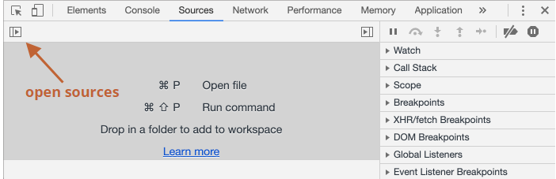
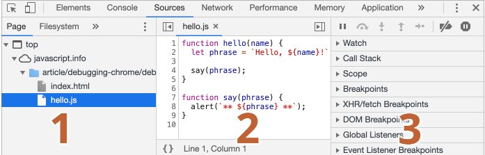
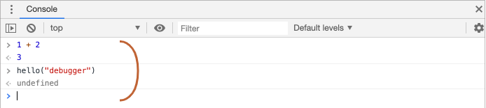
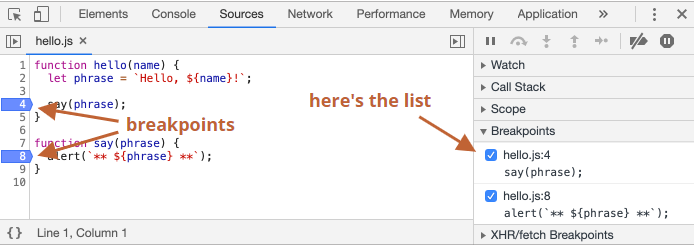
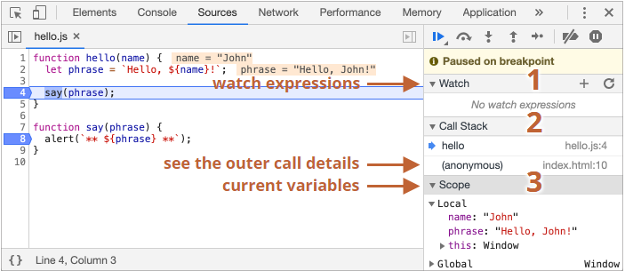
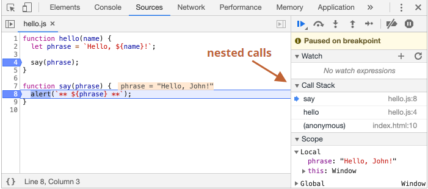

### 디버깅(debugging)
스크립트 내 에러를 검출해 제거하는 일련의 과정
* 모던 브라우저와 호스트 환경 대부분은 개발자 도구 안에 UI 형태로 디버깅 툴을 구비해 놓습니다.

디버깅 툴을 사용하면 디버깅이 훨씬 쉬워지고, 실행 단계마다 어떤 일이 일어나는지를 코드 단위로 추적할 수 있습니다.

이 글에선 Chrome 브라우저에서 제공하는 디버깅 툴을 사용하도록 하겠습니다.

# ‘Sources’ 패널
Chrome 버전에 따라 화면이 약간 다를 수 있지만, 구성은 크게 변하지 않습니다.

1. Chrome을 사용해 [예시 페이지](https://ko.javascript.info/article/debugging-chrome/debugging/index.html) 를 열기
2. `F12(MacOS: Cmd+Opt+I)`를 눌러 개발자 도구를 열기
3. `Sources` 탭을 클릭해 `Sources` 패널(panel)을 열기


   


화면 캡쳐

Sources 패널은 크게 세 개의 영역으로 구성
1. 파일 탐색 영역 : 페이지를 구성하는 데 쓰인 모든 리소스(HTML, JavaScript, CSS, 이미지 파일 등)를 트리 형태로 보여줌.
2. 코드 에디터 영역 : 리소스 영역에서 선택한 파일의 소스 코드를 보여줌
3. 자바스크립트 디버깅 영역 : 디버깅에 관련된 기능 제공

# 콘솔
`Esc`를 누르면 개발자 도구 하단부에 콘솔 창이 열린다.
여기에 명령어를 입력하고 `Enter`를 누르면 입력한 명령어가 실행된다.

콘솔 창에 구문(statement)을 입력하고 실행하면 아랫줄에 실행 결과가 출력된다.


# 중단점(breakpoint)

중단점 : 자바스크립트의 실행이 중단되는 코드 내 지점.
* 실행이 중지된 시점에 변수가 어떤 값을 담고 있는 지 알 수 있다.
* 실행이 중지된 시점을 기준으로 명령어를 실행할 수 있다.
* 따라서 디버깅이 가능하다.

Sources 패널 우측의 디버깅 영역을 보면 중단점 목록을 확인할 수 있다.
파일 여러 개에 다수의 중단점을 설정해 놓은 경우, 디버깅 영역을 이용하면 아래와 같은 작업을 할 수도 있다.
* 항목을 클릭해 해당 **중단점이 설정된 곳으로 바로 이동**
* 체크 박스 선택을 해제해 해당 **중단점을 비활성화**
* 마우스 오른쪽 버튼을 클릭했을 때 나오는 ‘Remove breakpoint’ 옵션을 통해 **중단점을 삭제**
* etc

> 조건부 중단점 : 설정한 표현식이 참인 경우에만 실행을 중지시킬 수 있다.
> 
> 줄 번호에 커서를 옮긴 후 마우스 오른쪽 버튼을 클릭 > `Add conditional breakpoint`를 클릭했을 때 뜨는 작은 창에 표현식을 입력
> 
> ??안되던데?? 아시는분!!

# debugger 명령어
스크립트 내에 debugger 명령어를 적어주면 중단점을 설정한 것과 같은 효과가 나타난다.
```javascript
function hello(name) {
  let phrase = `Hello, ${name}!`;

  debugger;  // <-- 여기서 실행이 멈춥니다.

  say(phrase);
}
```

# 멈추면 보이는 것들

디버깅 영역의 ▼를 클릭해 하위 패널들을 하나씩 펼칠 수 있다.
각 패널은 아래와 같은 기능을 제공한다.
1. `Watch` – 표현식을 평가하고 결과를 보여줍니다.
   `Add Expression 버튼 `+`를 클릭해 원하는 표현식을 입력한 후 Enter를 누르면 중단 시점의 값을 보여줍니다. 입력한 표현식은 실행 과정 중에 계속해서 재평가됩니다.
2. `Call Stack` – 코드를 해당 중단점으로 안내한 실행 경로를 역순으로 표시합니다.
   콜 스택 내의 항목을 클릭하면 디버거가 해당 코드로 휙 움직이고, 변수 역시 재평가됩니다.
3. `Scope` – 현재 정의된 모든 변수를 출력합니다.
  - `Local`은 함수의 지역 변수. 지역 변수 정보는 소스 코드 영역에서도 확인(강조 표시)할 수 있습니다.
  - `Global`은 함수 바깥에 정의된 전역 변수.
  - `Local `하위 항목으로 `this`에 대한 정보도 출력되는데, 이에 대해선 추후에 학습하도록 하겠습니다.

# 실행 추적하기

디버깅 영역 상단에 있는 버튼의 역할
*  – ‘Resume’: 스크립트 실행을 다시 시작 (단축키 F8)
*  – ‘Step’: 다음 명령어를 실행 (단축키 F9). 다음 문이 함수 호출일 때 함수 내부로 들어가 함수 본문 첫 번째 줄에서 실행을 멈춤.
*  – ‘Step over’: 다음 명령어를 실행하되, 함수 안으로 들어가진 않음 (단축키 F10)
*  – ‘Step into’ (단축키 F11)
  * 'Step’과 유사한데, 비동기 함수 호출에서 'Step’과는 다르게 동작합니다.
    * 'Step’은 setTimeout(함수 호출 스케줄링에 쓰이는 내장 메서드)같은 비동기 동작은 무시
    * 'Step into’는 비동기 동작을 담당하는 코드로 진입하고, 필요하다면 비동기 동작이 완료될 때까지 대기. 자세한 내용은 개발자 도구 매뉴얼에서 확인하시기 바랍니다.
*  – ‘Step out’: 실행 중인 함수의 실행이 끝날 때 까지 실행을 계속함 (단축키 Shift+F11)
  * 내부 동작을 알고 싶지 않은 중첩 함수로 진입했거나 가능한 한 빨리 함수 실행을 끝내고 싶은 경우 유용합니다,
*  – 모든 중단점을 활성화/비활성화(실행에는 영향X)
*  – 예외 발생 시 코드를 자동 중지시켜주는 기능을 활성화/비활성화
  * 활성화되어 있고, 개발자 도구가 열려있는 상태에서 스크립트 실행 중에 에러가 발생하면 실행이 자동으로 멈춥니다. 실행이 중단되었기 때문에 변수 등을 조사해 어디서 에러가 발생했는지 찾을 수 있게 됩니다. 개발하다가 에러와 함께 스크립트가 죽었다면 디버거를 열고 이 옵션을 활성화한 후, 페이지를 새로 고침하면 에러가 발생한 곳과 에러 발생 시점의 컨텍스트를 확인할 수 있습니다.

# console.log
console.log 함수를 이용하면 원하는 것을 콘솔에 출력할 수 있다.

# 요약
스크립트 실행이 중단되는 경우는 다음과 같습니다.
1. 중단점을 만났을 때
2. debugger문 만났을 때
3. 에러가 발생했을 때(개발자 도구가 열려있고  버튼이 '활성화’되어있는 경우)
스크립트 실행이 중지되면 중단 시점을 기준으로 변수에 어떤 값이 들어가 있는지 확인할 수 있습니다. 또한 단계별로 코드를 실행해 가며, 어디서 문제가 발생했는지 추적할 수도 있습니다. 이런 식으로 디버깅이 진행됩니다.

개발자 도구는 여기서 소개한 기능 이외의 다양한 기능을 지원합니다. Google에서 제공하는 개발자 도구 공식 매뉴얼은 https://developers.google.com/web/tools/chrome-devtools에서 확인할 수 있습니다.

출처 : https://ko.javascript.info/debugging-chrome
